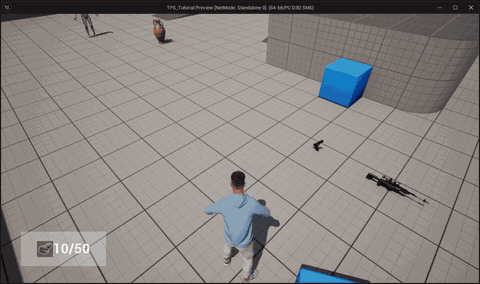

# TPS_Tutorial

Unreal Engine 5.3 기반 3인칭 슈터(TPS) 학습/포트폴리오 프로젝트입니다.
무기 픽업·발사·교체, 스나이퍼 스코프 실시간 렌더링, Field System을 통한 물체 파괴 상호작용, HUD,
그리고 **Gameplay Ability System(GAS)** 기반의 어빌리티/어트리뷰트 구조를 C++ 중심으로 구현했습니다.

---

## 데모



---

## 기술 스택

| 항목        | 내용                                                      |
| ----------- | --------------------------------------------------------- |
| 엔진        | Unreal Engine**5.3**                                |
| 언어        | C++ (게임플레이 로직 중심) + Blueprint (에셋/데이터 설정) |
| 입력        | Enhanced Input                                            |
| 핵심 시스템 | Gameplay Ability System (GAS), Chaos / Field System, UMG  |
| 빌드 도구   | Visual Studio 2022 + UnrealBuildTool                      |

### 주요 모듈 의존성 (`TPS_Tutorial.Build.cs`)

`Core`, `CoreUObject`, `Engine`, `InputCore`, `EnhancedInput`,
`GameplayAbilities`, `GameplayTags`, `GameplayTasks`,
`FieldSystemEngine`, `Chaos`, `ChaosSolverEngine`, `GeometryCollectionEngine`

---

## 주요 기능

### 🎯 무기 시스템

- 무기 픽업 / 장착 / 드랍 (인터페이스 기반 상호작용)
- 권총, 어설트 라이플, 스나이퍼, 샷건, 로켓/그레네이드 런처, 나이프 등 다중 무기 타입
- 소켓 기반 무기 부착 및 무기별 발사 로직
- 발사 반동, 격발 몽타주, AnimNotify 기반 연사 제어

### 🔭 스나이퍼 스코프 (실시간 렌더링)

- `SceneCaptureComponent2D` → `RenderTarget2D` → `DynamicMaterialInstance` 파이프라인으로
  스코프 렌즈에 실제 씬을 렌더링
- 줌 진입 시에만 캡처를 활성화하여 GPU 부하 최소화 (상시 캡처로 인한 GPU TDR/크래시 방지)

### 💥 파괴 상호작용 (Chaos / Field System)

- 발사 시 `ImpactField` 스폰으로 Geometry Collection 오브젝트 파괴

### 🧠 Gameplay Ability System (GAS)

- `UTPSAbilitySystemComponent` — 태그 기반 어빌리티 활성/취소 편의 래퍼
- `UTPSAttributeSet` — Health / MaxHealth / Stamina / MaxStamina, Pre/PostAttributeChange 클램프
- 어빌리티: **Sprint**(스태미나 소모 GE 연동), **Fire**(마이그레이션 진입점)
- `GameplayEffect_Damage` — Instant + SetByCaller 기반 데미지, `ApplyDamage()` 정적 헬퍼
- 네이티브 GameplayTag 정의, 사망 처리(라그돌·입력 차단·어빌리티 취소)
- 자세한 설계는 [`Docs/GAS_Spec.md`](Docs/GAS_Spec.md) 참고

### 🖥️ HUD / 데이터

- UMG 기반 HUD (무기/잔탄 정보, 크로스헤어)
- 게임 시작 시 DataTable 일괄 로드 (`UTPSDataManager`, 템플릿 기반 `FindRow`)
- 커스텀 GameInstance / UIManager

---

## 디렉터리 구조

```
Source/TPS_Tutorial/
├── Character/        # 플레이어 캐릭터 (입력·카메라·GAS 통합)
├── Actors/           # 무기, 픽업, 스나이퍼, 임팩트 필드
│   └── Components/   # 데이터 컴포넌트
├── GAS/              # Ability System Component / AttributeSet / Tags
│   ├── Abilities/    # GameplayAbility (Base, Sprint, Fire)
│   └── Effects/      # GameplayEffect (Damage)
├── Controller/       # PlayerController
├── AnimInstance/     # 애님 인스턴스
├── Manager/          # DataManager / UIManager / CameraManager
├── GameInstance/     # 커스텀 GameInstance
├── UI/               # HUD
├── Util/             # 유틸리티 (Path, Widget, Engine 등)
├── Logic/            # 인터페이스 / 공용 타입
└── Consts, Log/      # 상수 / 로깅

Docs/
├── GAS_Spec.md           # GAS 설계 명세
└── CodingConventions.md  # 코딩 컨벤션
```

---

## 빌드 및 실행

### 요구 사항

- Unreal Engine **5.3**
- Visual Studio **2022** (C++ 데스크톱 개발 + 게임 개발 워크로드)

### 절차

1. `TPS_Tutorial.uproject` 우클릭 → **Generate Visual Studio project files**
2. `TPS_Tutorial.sln`을 Visual Studio 2022로 열기
3. 솔루션 구성을 **Development Editor / Win64**로 설정 후 빌드
4. `TPS_Tutorial.uproject` 실행

> **⚠️ 빌드 도구 주의**
> 시스템에 Visual Studio Build Tools 2026 등 상위 버전이 함께 설치되어 있으면
> UnrealBuildTool이 그쪽 MSBuild를 잡아 `WorkloadAutoImportPropsLocator` 오류가 날 수 있습니다.
> 이 경우 `%APPDATA%\Unreal Engine\UnrealBuildTool\BuildConfiguration.xml`에서 컴파일러를
> `VisualStudio2022`로 고정하세요.

---

## 조작 (기본)

| 입력   | 동작              |
| ------ | ----------------- |
| WASD   | 이동              |
| 마우스 | 시점 회전         |
| 좌클릭 | 발사              |
| 우클릭 | 줌(스코프) 토글   |
| Space  | 점프              |
| Q/E    | 기울이기(Lean)    |
| V      | TPS/FPS 시점 전환 |
| G      | 무기 버리기       |

> 실제 키 매핑은 프로젝트의 Input Mapping Context를 따릅니다.

---

## 문서

- [`Docs/GAS_Spec.md`](Docs/GAS_Spec.md) — Gameplay Ability System 설계 명세 및 검토 체크리스트
- [`Docs/CodingConventions.md`](Docs/CodingConventions.md) — 코딩 컨벤션

---

## 라이선스 / 비고

학습 및 포트폴리오 목적의 프로젝트입니다.
일부 에셋(MetaHuman, 사운드 등)은 Epic Games 및 각 제공처의 라이선스를 따릅니다.
